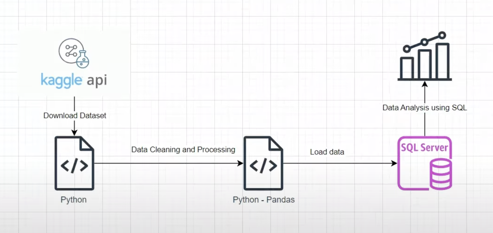

# End-to-End Retail Data Analysis Pipeline

This project demonstrates a complete, end-to-end data analytics workflow. It begins with raw data acquisition from the Kaggle API, proceeds through data cleaning and transformation using Python and Pandas, and culminates in loading the data into a SQL database for in-depth analysis.

---

## 🏛️ Project Architecture

The entire workflow is designed as a sequential data pipeline, ensuring a clear and organized process from start to finish.



The pipeline consists of the following stages:
1.  **Data Download**: The retail orders dataset is downloaded from Kaggle using its official API.
2.  **Data Cleaning and Processing**: The raw data is cleaned, processed, and transformed into an analysis-ready format using Python's Pandas library.
3.  **Data Loading**: The cleaned data is loaded into a SQL Server database, making it available for querying.
4.  **Data Analysis**: In-depth analysis is performed using SQL to derive business insights.

---

## 🛠️ Technologies Used

* **Python**: Core language for data processing and pipeline control.
* **Pandas**: For data manipulation, cleaning, and transformation.
* **Kaggle API**: For programmatic data acquisition.
* **SQLAlchemy**: To connect Python with the SQL database.
* **SQL (PostgreSQL/SQLite)**: For data querying and analysis.

---

## ⚙️ Project Workflow & Code

### 1. Data Acquisition and Preparation

The process starts in the `kaggle.ipynb` notebook.

* **Dataset Download**: The `ankitbansal06/retail-orders` dataset is downloaded from Kaggle using the command `!kaggle datasets download`.
* **File Extraction**: The downloaded `.zip` file is extracted to access the `orders.csv` file within it.

### 2. Data Cleaning and Transformation with Pandas

All data cleaning is performed within the `kaggle.ipynb` notebook.

* **Handling Missing Values**: Values like `Not Available` and `unknown` in the `ship_mode` column are identified and converted to `NaN` (null) for proper handling.
* **Column Standardization**:
    * All column names are converted to lowercase to maintain consistency (e.g., `Order ID` becomes `order_id`).
    * Spaces in column names are replaced with underscores (e.g., `cost price` becomes `cost_price`).
* **Feature Engineering**: New, more insightful columns are derived from the existing data:
    * `discount`: Calculated from `list_price` and `discount_percent`.
    * `sale_price`: Calculated as `list_price` - `discount`.
    * `profit`: Calculated as `sale_price` - `cost_price`.
* **Data Type Conversion**: The `order_date` column is converted from an object/string to a `datetime` object for time-series analysis.
* **Dropping Redundant Columns**: The original `list_price`, `cost_price`, and `discount_percent` columns are dropped to finalize the dataset for loading.

### 3. Loading Data into SQL

The cleaned Pandas DataFrame is loaded into a SQL database. The notebook provides an example for loading data into a local SQLite database, which is straightforward and requires no additional server setup. A `df_orders` table is created in the database to hold this data.

### 4. Data Analysis with SQL

The `Solution.sql` file contains all the queries used to extract business insights.

* **Find top 10 highest revenue-generating products**:
    ```sql
    SELECT
        product_id,
        category,
        SUM(sale_price) AS total_sales
    FROM df_orders
    GROUP BY product_id, category
    ORDER BY total_sales DESC
    LIMIT 10;
    ```

* **Find top 5 highest-selling products in each region**:
    ```sql
    WITH ranked_sales AS (
        SELECT
            region,
            product_id,
            SUM(sale_price) AS sales,
            ROW_NUMBER() OVER (
                PARTITION BY region
                ORDER BY SUM(sale_price) DESC
            ) AS rn
        FROM df_orders
        GROUP BY region, product_id
    )
    SELECT
        region,
        product_id,
        sales
    FROM ranked_sales
    WHERE rn <= 5
    ORDER BY region, sales DESC;
    ```

* **Find month-over-month growth comparison for 2022 and 2023 sales**:
    ```sql
    WITH cte AS (
        SELECT
            EXTRACT(YEAR FROM order_date) AS order_year,
            EXTRACT(MONTH FROM order_date) AS order_month,
            SUM(sale_price) AS sales
        FROM df_orders
        GROUP BY EXTRACT(YEAR FROM order_date), EXTRACT(MONTH FROM order_date)
    )
    SELECT
        order_month,
        ROUND(SUM(CASE WHEN order_year = 2022 THEN sales ELSE 0 END)::numeric, 2) AS sales_2022,
        ROUND(SUM(CASE WHEN order_year = 2023 THEN sales ELSE 0 END)::numeric, 2) AS sales_2023
    FROM cte
    GROUP BY order_month
    ORDER BY order_month;
    ```

* **For each category, find the month with the highest sales**:
    ```sql
    WITH cte AS (
        SELECT
            category,
            TO_CHAR(order_date, 'YYYYMM') AS order_year_month,
            SUM(sale_price) AS sales
        FROM df_orders
        GROUP BY category, TO_CHAR(order_date, 'YYYYMM')
    )
    SELECT *
    FROM (
        SELECT *,
               ROW_NUMBER() OVER (PARTITION BY category ORDER BY sales DESC) AS rn
        FROM cte
    ) a
    WHERE rn = 1;
    ```

* **Find the sub-category with the highest growth in profit in 2023 compared to 2022**:
    ```sql
    WITH cte AS (
        SELECT
            sub_category,
            EXTRACT(YEAR FROM order_date) AS order_year,
            SUM(profit) AS total_profit
        FROM df_orders
        GROUP BY sub_category, EXTRACT(YEAR FROM order_date)
    ),
    cte2 AS (
        SELECT
            sub_category,
            ROUND(SUM(CASE WHEN order_year = 2022 THEN total_profit ELSE 0 END):: numeric, 2) AS profit_2022,
            ROUND(SUM(CASE WHEN order_year = 2023 THEN total_profit ELSE 0 END):: numeric, 2) AS profit_2023
        FROM cte
        GROUP BY sub_category
    )
    SELECT *,
           (profit_2023 - profit_2022) AS profit_growth
    FROM cte2
    ORDER BY profit_growth DESC
    LIMIT 1;
    ```

---

## 🚀 How to Run This Project

1.  **Clone the Repository**
    ```bash
    git clone [https://github.com/your-username/Retail-Data-Analysis-Pipeline.git](https://github.com/your-username/Retail-Data-Analysis-Pipeline.git)
    cd Retail-Data-Analysis-Pipeline
    ```

2.  **Create a Virtual Environment and Install Dependencies**
    ```bash
    python -m venv venv
    source venv/bin/activate  # On Windows, use `venv\Scripts\activate`
    pip install -r requirements.txt
    ```
    *(Note: You will need to create a `requirements.txt` file using `pip freeze > requirements.txt`)*

3.  **Set Up Kaggle API**
    * Make sure your `kaggle.json` API token is placed in the `~/.kaggle/` directory.

4.  **Run the Jupyter Notebook**
    * Launch Jupyter Notebook and run the cells in `kaggle.ipynb` sequentially. This will clean the data and create a local SQLite database file (`retail_orders.db`) in your project folder.

5.  **Execute SQL Analysis**
    * Connect to the newly created `retail_orders.db` using a SQL client of your choice (like DBeaver, DB Browser for SQLite, or a VSCode extension).
    * Run the queries from `Solution.sql` to see the final analysis.
